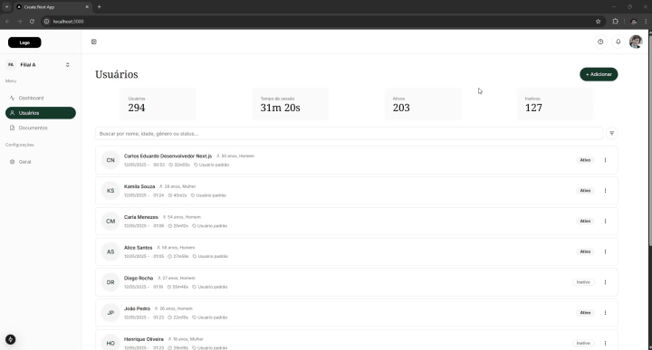

# 🚀 Dashboard Users — Next.js + Shadcn

Painel de gestão de usuários criado com **Next.js**, **TypeScript**, **Tailwind CSS**, **Shadcn UI** e **Firebase**.



## 📌 Descrição do Desafio

Este projeto é parte de um desafio técnico que exigia:

- ✅ **Listagem de usuários**
- ✅ **Botão de adição de novo usuário**
- ✅ **Modal lateral (com Shadcn) para adição/edição**
- ✅ **Interface 100% fiel ao Figma fornecido**
- ✅ **Uso exclusivo do Shadcn para componentes**
- ✅ **Personalização visual com Tailwind CSS**
- ✅ **Publicação do projeto (Vercel)**

---

## ✨ O que foi feito além do escopo

- 🔥 Integração completa com **Firebase Firestore**
- 🔍 Sistema de **filtros inteligentes** por nome, idade, gênero e status
- 🧩 Modal **reutilizável** para criação e edição de usuários
- 📱 Layout 100% **responsivo**
- 📦 Sidebar com **colapso animado**
- 🎨 Layout **pixel-perfect** baseado no Figma
- 📌 Notificações com **toasts do Shadcn**
- 🎯 Geração automática de dados adicionais como idade, data, horário e gênero

---

## 🛠️ Tecnologias

- [Next.js 14](https://nextjs.org)
- [TypeScript](https://www.typescriptlang.org)
- [Tailwind CSS](https://tailwindcss.com)
- [Shadcn/ui](https://ui.shadcn.com/)
- [Firebase (Firestore)](https://firebase.google.com/)
- [Lucide React](https://lucide.dev/)

---

## 📷 Demonstração


---

## 🔗 Deploy

🔗 [Clique aqui para acessar o projeto na Vercel](https://dashboard-user-next-5og0z7dlx-carloseduardob94s-projects.vercel.app/)

---

## 📦 Como rodar localmente

```bash
# 1. Clone o repositório
git clone https://github.com/seu-usuario/seu-repo.git

# 2. Acesse a pasta
cd seu-repo

# 3. Instale as dependências
npm install

# 5. Inicie o servidor
npm run dev